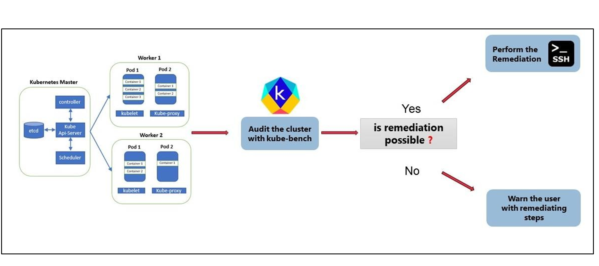
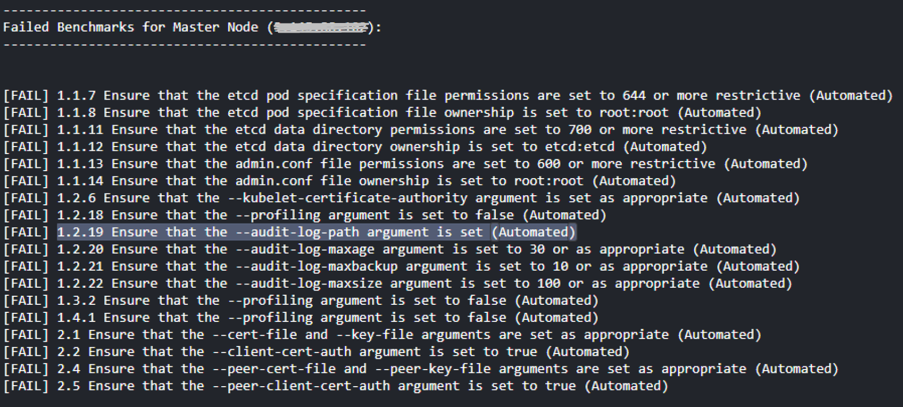
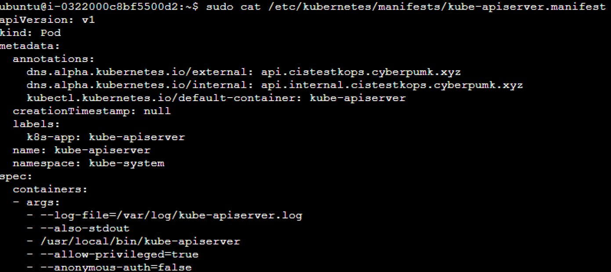
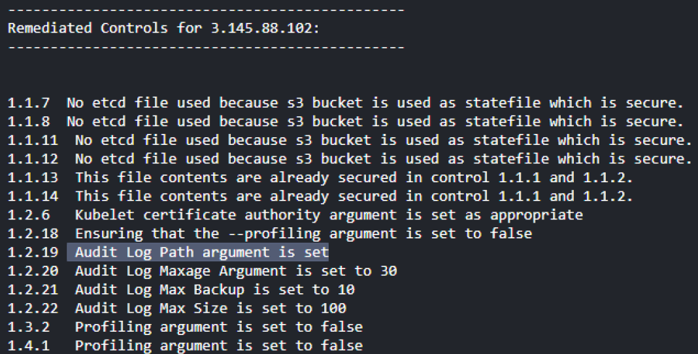
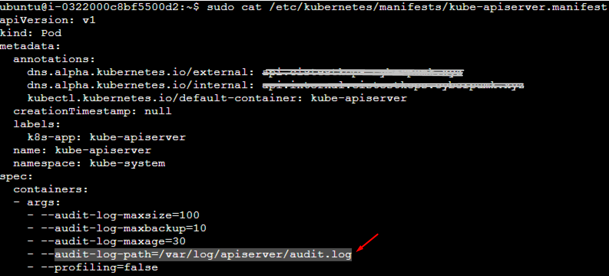

# securenetes-hardening-k8s-cluster
For automatic hardening of K8s cluster, by enforcing and implementing [CIS benchmark recommendations](https://www.cisecurity.org/benchmark/kubernetes).

## How to use?

The script ([main.py](./main.py)) supports the use of the below three arguments. You can run the Python code with any of the below arguments (must declare one).
  - `--include-auto`: To remediate all controls that can be done automatically
  - `--include-all`: To remediate all automated controls and provide steps to remediate controls that require manual intervention.
  - `--exempt`: To exclude certain controls from automatic remediation. Useful for production scenarios.

You will need to input the `username` to connect to the K8s cluster, and also the SSH Key to connect to the cluster nodes.

### Adding exemptions

If you would like to exempt remediation of certain controls, you need to mention the control ID in the [exempt.txt](./exempt.txt) file.

### Dependencies

- This script requires you to have `kubectl` and `kops` tools installed in the machine that will run the script.
- Make sure to have the private key of nodes in the particular directory so the tool can access them while using paramiko client to SSH.
- Configure the CLI to assume the role with permissions to access the nodes if they were hosted on the cloud and assure that the state holder storages are accessible when buckets are used as `etcd` storage.
- Validate the cluster from CLI to make sure that the cluster is ready and accessible by running the below command,
  ```sh
  kops validate cluster
  ```

## Solution Architecture

As shown below, this tool depends on `kubebench` utility to perform the security audit of the k8s cluster, and to perform the automatic remediation with the python script.



This script helps in remediating the security controls as shown in [CIS benchmark recommendations](https://www.cisecurity.org/benchmark/kubernetes). Refer to their site for more information on the controls and commands that you could use to perform the remediation.

## Remediated Controls

<details>
<summary> Click here to view the controls </summary>

There are a bunch of security controls that could be automated (supported by this script) for both the master and the worker nodes.

### In Master Node

| **Control ID** |  **Description** | **Remediation Commands**|
| -- | -- | -- |
| 1.1.1 | Ensure that the API server pod specification file permissions are set to `600` or more restrictive | `sudo chmod 600/etc/kubernetes/manifests/kube-apiserver.manifest` |
| 1.1.2 | Ensure that the API server pod specification file ownership is set to `root:root`. | `sudo chown root:root /etc/kubernetes/manifests/kube-apiserver.manifest` |
| 1.1.3 | Ensure that the controller manager pod specification file permissions are set to `600` or more restrictive | `sudo chmod 600 /etc/kubernetes/manifests/kube-controller-manager.manifest` |
| 1.1.4 | Ensure that the controller manager pod specification file ownership is `root:root`. | `sudo chown root:root /etc/kubernetes/manifests/kube-controller-manager.manifest` |
| 1.1.5 | Ensure that the scheduler pod specification file permissions are are set to `600` or more restrictive | `sudo chmod 600 /etc/kubernetes/manifests/kube-scheduler.manifest` |
| 1.1.6 | Ensure that the scheduler pod specification file ownership is `root:root`. | `sudo chown root:root /etc/kubernetes/manifests/kube-scheduler.manifest` |
| 1.1.19 | Ensure that the Kubernetes PKI directory ownership is `root:root`. | `sudo chown -R root:root /etc/kubernetes/pki/` |
| 1.2.2 | Ensure the `--token-auth-file` parameter is not set. | Remove `--token-auth-file=<filename>` from `/etc/kubernetes/manifests/kube-apiserver.manifest` |
| 1.2.4 | Ensure `--kubelet-https` argument is set to true. | Add `--kubelet-https=true` in `/etc/kubernetes/manifests/kube-apiserver.manifest`  |
| 1.2.5 | Ensure `--kubelet-client-certificate` and `--kubelet-client-key` arguments are set. | Add `--kubelet-client-certificate=/srv/kubernetes/kube-apiserver/kubelet-api.crt --kubelet-client-key=/srv/kubernetes/kube-apiserver/kubelet-api.key` |
| 1.2.6 | Ensure `--kubelet-certificate-authority` argument is set. | Add `--kubelet-certificate-authority=/srv/kubernetes/ca.crt` |
| 1.2.7 | Ensure `--authorization-mode` argument is not `AlwaysAllow`. | Ensure `--authorization-mode=AlwaysAllow` is not present. Use values like `Node`, `RBAC`. |
| 1.2.8 | Ensure `--authorization-mode` argument includes `Node`. | Ensure `--authorization-mode=Node` is present. |
| 1.2.9 | Ensure `--authorization-mode` argument includes `RBAC`. | Ensure `--authorization-mode=RBAC` is present. |
| 1.2.11 | Ensure admission plugin is not set to `AlwaysAdmit`. | Remove `--enable-admission-plugins=AlwaysAdmit` or set other values. |
| 1.2.14 | Ensure `ServiceAccount` plugin is set. | Ensure `--disable-admission-plugins=ServiceAccount` is not present. |
| 1.2.15 | Ensure `NamespaceLifecycle` plugin is set. | Ensure `--disable-admission-plugins=NamespaceLifecycle` is not present. |
| 1.2.16 | Ensure `NodeRestriction` plugin is set. | Ensure `--enable-admission-plugins=NodeRestriction` is present. |
| 1.2.17 | Ensure `--secure-port` argument is non-zero. | Ensure `--secure-port` is set to a non-zero value. |
| 1.2.18 | Ensure `--profiling` argument is false. | Set `--profiling=false` |
| 1.2.19 | Ensure `--audit-log-path` argument is set. | Add `--audit-log-path=/var/log/apiserver/audit.log` |
| 1.2.20 | Ensure `--audit-log-maxage` argument is set. | Add `--audit-log-maxage=30` |
| 1.2.21 | Ensure `--audit-log-maxbackup` argument is set. | Add `--audit-log-maxbackup=10` |
| 1.2.22 | Ensure `--audit-log-maxsize` argument is set. | Add `--audit-log-maxsize=100` |
| 1.2.24 | Ensure `--service-account-lookup` argument is true. | Add `--service-account-lookup=true` |
| 1.2.25 | Ensure `--service-account-key-file` argument is set. | Add `--service-account-key-file=/srv/kubernetes/kube-apiserver/service-account.pub` |
| 1.2.26 | Ensure `--etcd-certfile` and --etcd-keyfile arguments are set. | Add `--etcd-certfile=/srv/kubernetes/kube-apiserver/etcd-client.crt --etcd-keyfile=/srv/kubernetes/kube-apiserver/etcd-client.key` |
| 1.2.27 | Ensure `--tls-cert-file` and --tls-private-key-file arguments are set. | Add `--tls-cert-file=/srv/kubernetes/kube-apiserver/server.crt --tls-private-key-file=/srv/kubernetes/kube-apiserver/server.key` |
| 1.2.28 | Ensure `--client-ca-file` argument is set. | Add `--client-ca-file=/srv/kubernetes/ca.crt` |
| 1.2.29 | Ensure `--etcd-cafile` argument is set. | Add `--etcd-cafile=/srv/kubernetes/kube-apiserver/etcd-ca.crt` |
| 1.3.2 | Ensure `--profiling` argument is false (controller). | Set `--profiling=false` in `/etc/kubernetes/manifests/kube-controller-manager.manifest` |
| 1.3.3 | Ensure `--use-service-account-credentials` argument is true. | Set `--use-service-account-credentials=true` |
| 1.3.4 | Ensure `--service-account-private-key-file` argument is set. | Set `--service-account-private-key-file=/srv/kubernetes/kube-controller-manager/service-account.key` |
| 1.3.5 | Ensure `--root-ca-file` argument is set. | Set `--root-ca-file=/srv/kubernetes/ca.crt` |
| 1.3.6 | Ensure `RotateKubeletServerCertificate` argument is true. | Set `--feature-gates=RotateKubeletServerCertificate=true` |
| 1.3.7 | Ensure `--bind-address` argument is `127.0.0.1`. | Set `--bind-address=127.0.0.1` |
| 1.4.1 | Ensure `--profiling` argument is false (scheduler). | Set `--profiling=false` in `/etc/kubernetes/manifests/kube-scheduler.manifest` |
| 1.4.2 | Ensure `--bind-address` argument is `127.0.0.1` | Set `--bind-address=127.0.0.1`|


### In Worker Node

| **Control ID** |  **Description** | **Remediation Commands**|
| -- | -- | -- |
| 4.1.1 | Ensure kubelet service file permissions are set to `600` or more restrictive | `sudo chmod 600 /lib/systemd/system/kubelet.service` |
| 4.1.2 | Ensure kubelet service file ownership is `root:root` | `sudo chown root:root /lib/systemd/system/kubelet.service`|
| 4.1.5 | Ensure `--kubeconfig` permissions are set to `600` or more restrictive | `sudo chmod 600 /var/lib/kubelet/kubelet.conf` |
| 4.1.6 | Ensure `--kubeconfig ownership is `root:root`. | `sudo chown root:root /var/lib/kubelet/kubelet.conf` |
| 4.1.9 | Ensure kubelet `config.yaml` permissions are set to `600` or more restrictive | `sudo chmod 600 /var/lib/kubelet/kubeconfig` |
| 4.1.10 | Ensure kubelet `config.yaml` ownership is root:root | `sudo chown root:root /var/lib/kubelet/kubeconfig`|
| 4.2.1 | Ensure `--anonymous-auth` is false. | Add `--anonymous-auth=false` in `/lib/systemd/system/kubelet.service` |
| 4.2.2 | Ensure `--authorization-mode` is not AlwaysAllow. | Add `--authorization-mode=Webhook` in `/lib/systemd/system/kubelet.service` |
| 4.2.3 | Ensure `--client-ca-file` is set. | Add `--client-ca-file=/srv/kubernetes/ca.crt` in `/lib/systemd/system/kubelet.service` |
| 4.2.6 | Ensure `--protect-kernel-defaults` is true. | Add `--protect-kernel-defaults=true` in `/lib/systemd/system/kubelet.service` |
| 4.2.7 | Ensure `--make-iptables-util-chains` is true. | Add `--make-iptables-util-chains=true` in `/lib/systemd/system/kubelet.service` |
| 4.2.11 | Ensure `--rotate-certificates` is not false. | Remove `--rotate-certificates=false` in `/lib/systemd/system/kubelet.service` |

</details>

## Sample Run Results

I ran the command `python main.py --include-auto` to remediate all controls that can be automatically remediated in my K8s cluster. Below is the result,

  

Let's focus on one of the failed control checks (say, _4.2.7_). This control involves setting the `--audit-log-path` argument in the API server pod specification file, typically found at `/etc/kubernetes/manifests/kube-apiserver.yaml` on the Control Plane node.

- Before remediation:

  

  As you can see, `--make-iptables-util-chains=true` setting is missing in this file.

- After remediation:

  - Once I run the script, it shows the list of controls that were remediated in the master node.

    


  - You can see that the setting is now added in the affected file.
    
    

  Now, if you run the control check again, or during the next scheduled run, you can check that the control has passed!


## Limitations and known issues

- Exceptions and error conditions (to be added soon)
- An alternate way to log in to the nodes without supplying SSH-key (to be tested).

